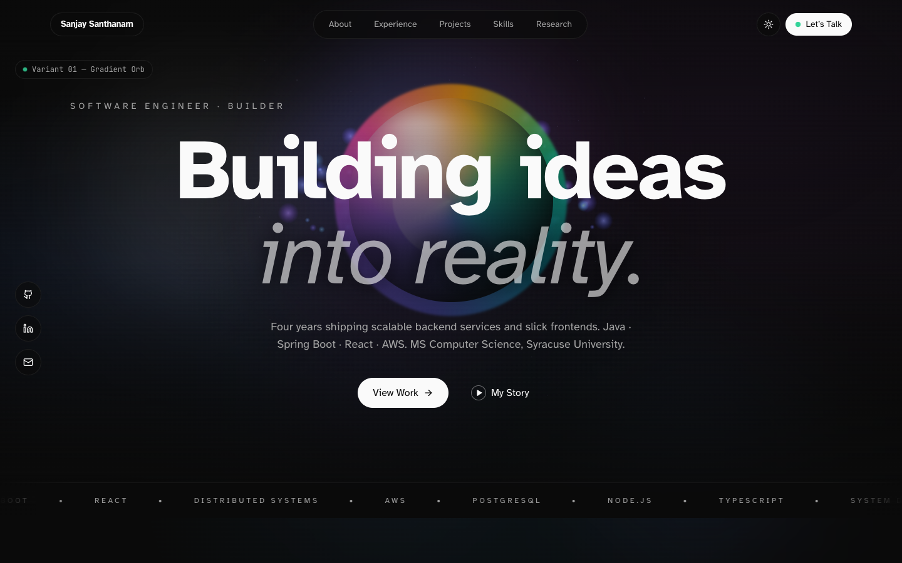
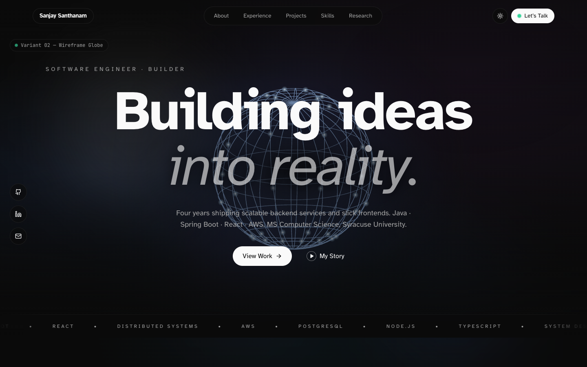
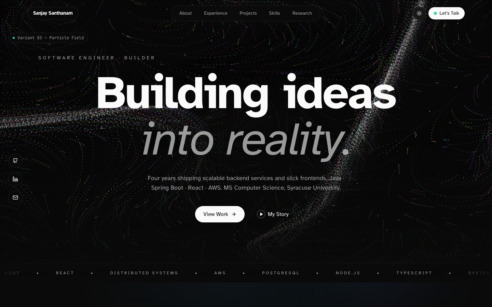
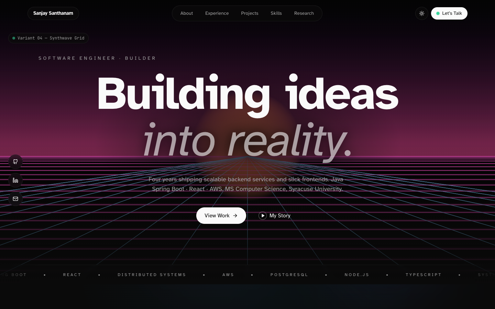

# Portfolio Hero Experiment

Four animated hero centerpieces wrapped around the same editorial shell.
Built in one shot to compare aesthetics side-by-side — same nav, same typography, same CTAs, only the canvas behind changes.

🔗 **Live:** https://sanjays2402.github.io/portfolio-hero-experiment/

## Variants

| Route | Style | Tech |
|---|---|---|
| `/v1` | Gradient Orb | Layered conic-gradient sphere + orbiting particles |
| `/v2` | Wireframe Globe | Rotating lat/lng grid, isometric projection, glowing nodes |
| `/v3` | Particle Field | 1,500 points flowing through a noise vector field |
| `/v4` | Synthwave Grid | Perspective tunnel + sun, outrun aesthetic |

### v1 — Gradient Orb


### v2 — Wireframe Globe


### v3 — Particle Field


### v4 — Synthwave Grid


## Stack

- Next.js 14 (app router, static export)
- Tailwind CSS
- Framer Motion (entrance choreography only)
- Canvas 2D — no three.js, no WebGL libs
- Deployed to GitHub Pages via Actions

## Run locally

```bash
npm ci
npm run dev
# → http://localhost:3000
```

Visit `/` for the gallery, or `/v1`–`/v4` for individual heroes.
